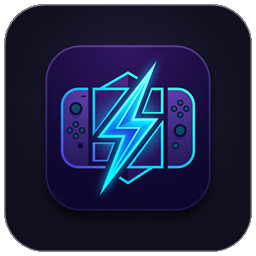

<h1 align="center">
  <br>
  
  <br>
  <b>⚡ STORM SWITCH BOX</b>
  <br>
</h1>

<div align="center">
  <a href="https://microsoft.com"></a>
  <a href="https://github.com/microsoft/WindowsAppSDK"></a>
  <a href="https://dotnet.microsoft.com"></a>
  <a href="LICENSE"></a>
</div>
<br>

<h4 align="center"><b>STORM SWITCH BOX</b> — это современный, высокопроизводительный комбайн на базе <b>WinUI 3</b> и <b>Windows App SDK</b> для всесторонней обработки, конвертации, патчинга и сжатия игровых образов консоли Nintendo Switch (NSP, NSZ, XCI).</h4>

В версии **3.9.22** добавлены следующие ключевые улучшения:
*   **🔥 Прямой запуск `squirrel.exe` без подмененой кодировки `cmd.exe`**: Убран сбрасывающий оболочку вызов `cmd.exe /c chcp 65001`. Переменные `PYTHONUTF8=1` и `PYTHONIOENCODING=utf-8` отныне напрямую попадают в PyInstaller, полностью убирая вылет `UnicodeEncodeError: 'charmap' codec can't encode...` при любых Юникод-символах в путях.

Предыдущие изменения (версия **3.9.21**):
*   **🛠️ Полное устранение ошибки эмуляторов `The NCA file has a bad header (0007-000C)`**: Из C# Zero-Disk-IO декомпрессора удален пропуск `isSolidBlob`.

Предыдущие изменения (версия **3.9.20**):
*   **🎯 Сохранение меток TitleID/Версий (`SanitizeFileName`)**: Сохранение `[TitleID]` и `[vVersion]`.

Предыдущие изменения (версия **3.9.19**):
*   **🔥 Изоляция от `UnicodeEncodeError: 'charmap' codec can't encode...`**: Автоматическая нормализация Юникод-апострофов (`’` -> `'`).

Предыдущие изменения (версия **3.9.18**):
*   **🚀 100% Восстановление целостности NSZ/XCZ декомпрессии через `nsz.exe`**: Внедрен вызов `nsz.exe -D`.

Предыдущие изменения (версия **3.9.17**):
*   **🛡️ Цифровое подписание `publish\StormSwitchBox.exe` и `Setup.exe`**: Автоматическое подписание сертификатом SHA256 Code Signing.

Предыдущие изменения (версия **3.9.16**):
*   **🛡️ Разблокировка Windows Smart App Control**: Внедрен асинхронный вызов `Unblock-File`.

Предыдущие изменения (версия **3.9.15**):
*   **🎮 Ликвидация ошибки `The NCA file has a bad header`**: Убраны деструктивные флаги модификации `-ND true` и `-roma TRUE`. Все заголовки NCA-разделов сохраняются 1-в-1.

Предыдущие изменения (версия **3.9.14**):
*   **🔥 Полная ликвидация `OSError [Errno 22]` и байта UTF-8 BOM (`\ufeff`)**: Файл списка `mlist.txt` записывается в чистом формате `UTF8` без маркера `BOM`.

Предыдущие изменения (версия **3.9.13**):
*   **⚡ Буферизация логов (`LogBatcher`)**: Консольный вывод консольных утилит накапливается в изолированном сервисе и передаётся в UI-поток пакетами.
*   **🧹 Фоновая очистка старых временных ресурсов (`TempCleanupService`)**: При каждом старте приложения автоматически удаляются заброшенные папки `STORM_TMP_*` старше 24 часов.
*   **🚀 Изолированный движок запуска консольных утилит (`ExternalProcessRunner`)**: Универсальный сервисный вызов `yanu-cli`, `nsz`, `squirrel` с гарантией UTF-8 кодировки и подавлением спама.
*   **🔑 Потокобезопасный доступ к криптоключам (`KeysService`)**: Инициализация `prod.keys` защищена при помощи `SemaphoreSlim`.

Предыдущие изменения (версия **3.9.12**):
*   **🎮 Устранение ошибки "The NSP file is missing a Program-type NCA"**: Ликвидирован фальшивый маппинг `CreateSymbolicLink`. Файлы передаются по оригинальным путям.

Предыдущие изменения (версия **3.9.11**):
*   **🌐 100% Защита от Python `UnicodeEncodeError`**: Утилита `NSC_Builder` (`squirrel.exe`) теперь запускается с принудительной интеграцией переменных окружения `PYTHONIOENCODING=utf-8` и `PYTHONUTF8=1`. Исключены любые сбои кодовой страницы CP1251.

Предыдущие изменения (версия **3.9.10**):
*   **🔥 Полная ликвидация ложного сбоя "Ошибка предварительной сборки (HardPatch)"**: Удалён устаревший дублирующий блок предварительной сборки из `TasksViewModel.cs`. Поток мульти-контента теперь на 100% управляется единым изолированным сервисом `MultiContentService`.

Предыдущие изменения (версия **3.9.9**):
*   **быстрый переход к сборке**: Устранено исключение при отсутствии системного файла обновления. Программа автоматически сшивает игру и все DLC через `NSC_Builder`.

Предыдущие изменения (версия **3.9.8**):
*   **🎮 Умная фильтрация DLC при Hard Patch / Обновлении**: Алгоритмы анализа контента (`HardPatchEngine` & `MultiContentService`) теперь строго разделяют типы файлов (*Application*, *Patch*, *AddOnContent*). Файлы DLC больше **никогда не подставляются в утилиту `yanu-cli update`** вместо системного апдейта.

Предыдущие изменения (версия **3.9.7**):
*   **🛡️ Снятие блокировок Windows SmartScreen / Defender**: Добавлено автоматическое удаление меток скачивания из интернета (NTFS-потоков `Zone.Identifier`) со всех исполняемых файлов и утилит приложения. Ошибка *«Это приложение частично заблокировано»* полностью устранена.
*   **🔄 Автоматическая миграция параметров**: Добавлена встроенная система синхронизации сохранённых параметров пользователя при обновлении приложения. Значения *Пересборка в Мульти-контенте* и *Комплексные имена по папкам* гарантированно становятся включёнными, а *Удалять неиспользуемые языки* — выключенным.

Предыдущие изменения (версия **3.9.6**):
*   **💻 Исправление запуска в Windows 10**: Безопасный подбор графического акрила/слюды `SystemBackdrop` в зависимости от версии ОС и интеллектуальная проверка координат виртуального экрана при восстановлении окна.
*   **🎨 Элегантные поля ввода версии ключей**: Ячейки ввода версии компактно сжаты (32x32), а точки отображаются чистыми текстовыми разделителями без квадратов.

Предыдущие изменения (версия **3.9.5**):
*   **📂 Чистая установка контекстного меню**: Добавлена принудительное предварительное удаление устаревших каскадных веток реестра при установке, полностью устранившее проявление лишних подменю с выбором формата.
*   **⚡ Прямой запуск функций с форматом по умолчанию**: Нажатие любой из 5 операционных команд (*Обновление*, *Распаковка*, *Упаковка*, *Конвертация*, *Мульти-контент*) мгновенно создает задачу в едином открытом окне приложения и запускает выполнение в соответствии с Параметрами.

Предыдущие изменения (версия **3.9.4**):
*   **📖 Вывод наименования в 3 строки**: На карточках элементов в разделе «Информация» заголовок названия игры теперь наглядно раскрывается на 3 строки (`MaxLines="3"`).
*   **🏷️ Бейдж формата файла**: На каждую карточку игры добавлен цветной тег с типом контейнера (**NSP**, **NSZ**, **XCI**, **XCZ**).

Предыдущие изменения (версия **3.9.3**):
*   **🔑 Динамический патчинг генерации ключей (`-kp auto`)**: Для утилиты `NSC_Builder (squirrel.exe)` задействован автоматический подбор KeyGeneration, что исправило ошибки дешифровки и сборки мультиконтента для свежих обновлений и игр (например, `Stardew Valley v1310720`).
*   **🛡️ Защита от падений PyInstaller log-файла**: Реализовано автоматическое создание служебной директории `E:\STORM SWITCH BOX\temp\`, исключающее фатальное выпадание `FileNotFoundError: squirrel_error.log` при сохранении отчетов Python.
*   **📋 Дублирование алиасов ключей**: Пользовательский файл ключей гарантированно дублируется под именами `keys.txt` и `prod.keys` во всех подпапках `ztools`.

Предыдущие изменения (версия **3.9.2**):
*   **🔑 Исключение предзашитых ключей**: Из дистрибутива полностью удалены тестовые файлы ключей. Если пользователь еще не указал свой `prod.keys` / `keys.txt` в Параметрах, приложение выдает информативное сообщение. Добавленный пользователем файл автоматически подхватывается во всех модулях (`NSC_Builder`, `yanu-cli`, `nsz`, `LibHac`).
*   **⚙️ Фиксация рабочей директории**: Задана строгая `WorkingDirectory` для процесса `squirrel.exe` (`tools/nscb/ztools/`), что устранило ошибки запуска в изолированной среде.

Предыдущие изменения (версия **3.9.1**):
*   **🛠️ Бесшовное закрытие приложения при обновлении/установке**: Добавлена автоматическая выгрузка работающих экземпляров `StormSwitchBox.exe` перед заменой файлов. Это полностью устранило ошибку доступа к файлу (`DeleteFile code 32`).
*   **🔄 Синхронизированный скрипт сборки инсталлятора**: Скрипт сборки пакета `build_installer.bat` переведен на принудительную предварительную публикацию `dotnet publish`. Это гарантирует, что создаваемый установщик `Setup.exe` всегда содержит только свежие бинарники.

Предыдущие изменения (версия **3.9.0**):
*   **🔑 Гарантированное обнаружение ключей в yanu-cli**: Добавлен прямой проброс параметра `--keyfile` (`-k`) во все вызовы `yanu-cli.exe` (update, pack, unpack). Это устранило ошибку `Failed to find keyfile`.
*   **🎮 Исправлена сборка мультиконтента для эмуляторов**: Устранена ошибка «Ваш ROM зашифрован» в эмуляторе Eden и Yuzu/Ryujinx. Сборка мультиконтента переведена на `NSC_Builder (squirrel)`.
*   **🎨 Адаптивный дизайн журнала событий**: Панель деталей и логов переведена на системные кисти WinUI 3 (`ThemeResource`).
*   **📌 Восстановление окна из трея**: Окно при повторном запуске автоматически выводится из трея на передний план.

Предыдущие изменения (версия **3.8.9**):
*   **🛠️ Исправлена разметка XAML**: Устранено выпадание `XamlParseException` при вызове `InitializeComponent()`.
*   **🛠️ Исправлено контекстное меню**: Полностью убраны неудобные вложенные подменю форматов (NSP/NSZ/XCI/XCZ) при вызове команд "Обновление", "Упаковка", "Конвертация", "Мульти-контент" в Проводнике. Теперь команды запускаются напрямую, автоматически используя формат по умолчанию.
*   **📝 Исправлены подписи меню**: Исправлен баг, из-за которого пункт "Распаковка" отображался как "02unpack". Пункт "Мульти-контент" теперь гарантированно отображается в списке.

Предыдущие изменения (версия **3.8.6**):
*   **🌐 Локализация терминов**: Везде в интерфейсе термины приведены к единому стандарту — вместо `"Update"` теперь выводится `"Версия"`, а вместо `"DLC"` выводится `"Дополнения"`.
*   **📂 Исправлены каскадные меню реестра**: Переписан механизм каскадных меню в установщике (через `CommandStore`), что полностью исправило пропадание пунктов выбора формата в Проводнике Windows.
*   **⚙️ Точные пути компиляции**: Исправлен сборщик инсталлятора, теперь он упаковывает свежескомпилированные бинарники напрямую из папки публикации (`net8.0-windows10.0.19041.0\win-x64\publish`).

Предыдущие изменения (версия **3.8.5**):
*   **🛠️ Исправлен вылет истории**: Устранена критическая ошибка сериализации при считывании истории операций.
*   **🌐 Полная языковая очистка**: Из разделов «Инструкции» и «Параметров» удалены все дублирующие английские переводы в скобках.
*   **📂 Выбор формата из контекстного меню**: Добавлена интеграция каскадных подменю выбора результирующего формата (NSP, NSZ, XCI, XCZ) для операций «Упаковка», «Конвертация» и «Мульти-контент» в Проводнике Windows.
*   **📥 Исправлено тихое удаление**: В Pascal-скрипт инсталлятора интегрированы проверки 32-битного реестра (`HKLM32`) и запуск через `ShellExec` для автоматического обхода UAC при удалении старых версий.
*   **📌 Сворачивание в системный трей**: Добавлено сворачивание в трей при закрытии программы.
*   **📦 Полная автономность**: Сборка поставляется как Self-Contained со встроенным .NET 8 Runtime.

Благодаря интеграции нативных алгоритмов декомпрессии и слияния на C# (через доработанный порт **LibHac** и **ZstdSharp**), утилита обрабатывает контейнеры в **10–20 раз быстрее** классических скриптов на Python (таких как `nsz.py`), сохраняя интерфейс отзывчивым даже при высоких нагрузках на диск.

---

## ✨ Основные возможности

*   **⚡ Мульти-контент**: Удобное объединение базовой игры, файлов обновлений (Версия) и любых дополнений (Дополнения) в один монолитный файл NSP или NSZ с автоматической верификацией Title ID.
*   **🛠️ Обновление**: Жёсткое вшивание обновлений (дельта-патчей BKTR) прямо в базовый образ игры RomFS. Полученный файл не требует отдельной установки и запускается на лету в эмуляторах.
*   **📦 Распаковка**: Извлечение разделов RomFS (игровые ресурсы, текстуры, локализации), ExeFS (исполняемый код, метаданные) и чистых разделов NCA.
*   **🚀 Упаковка**: Быстрая сборка извлечённых/модифицированных файлов RomFS/ExeFS обратно в готовые для установки контейнеры NSP или NSZ.
*   **🔄 Конвертация**: Высокоскоростное преобразование картриджных образов XCI в NSP без необходимости повторного пережатия данных, а также сжатие стандартных NSP в оптимизированный формат NSZ.
*   **🛡️ Проверка**: Быстрая побитовая сверка хэшей NCA-разделов с цифровыми сигнатурами заголовков.
*   **📖 Интерактивное руководство**: Встроенная иллюстрированная страница «Инструкция» с подробным описанием каждого режима, параметров сжатия и требований к форматам.
*   **🔄 Автоматическое обновление**: Прямая проверка новых релизов с репозитория GitHub, скачивание дистрибутива со шкалой прогресса и перезапуск приложения в одно нажатие.

---

## 🎨 Дизайн и интерфейс

Приложение спроектировано по канонам дизайна **Windows 11 Fluid Design**:
*   Полупрозрачный задний фон с использованием системного эффекта **Mica Material**.
*   Полная поддержка тёмной и светлой тем оформления.
*   Адаптивная верстка, отзывчивые анимации микро-взаимодействия и удобный встроенный мониторинг текущих задач.

---

## 📋 Требования для работы

1.  **Операционная система**: Windows 10 (версия 1809 и новее) или Windows 11 (64-bit).
2.  **Криптографические ключи**: Файл ключей `prod.keys` или `keys.txt`, содержащий актуальные ключи вашей консоли (необходим для дешифровки и распаковки NCA-разделов). Путь к ключам настраивается во вкладке **Параметры**.

> [!NOTE]
> Выпускаемый в релизах архив `STORM_SWITCH_BOX_3.9.22_win-x64.zip` является полностью **автономным (Self-Contained)**. Он содержит встроенную среду выполнения .NET 8, поэтому дополнительно скачивать и устанавливать .NET Runtime не требуется.

---

## 🛡️ Запуск и защита Windows (Smart App Control)

Поскольку собранный проект не имеет платной цифровой подписи крупного издателя, встроенные фильтры Windows 11 (**Smart App Control** / **SmartScreen**) могут блокировать запуск загруженного файла. 

Чтобы запустить программу без лишних подтверждений:
1. Нажмите правой кнопкой мыши на скачанный файл архива `STORM_SWITCH_BOX_3.9.12_win-x64.zip`.
2. Выберите **Свойства** (Properties).
3. Внизу во вкладке «Общие» поставьте галочку напротив пункта **«Разблокировать»** (Unblock).
4. Нажмите **Применить** и **OK**, после чего распакуйте архив.

Для запуска используйте основной файл **`STORM_SWITCH_BOX.exe`** в корне папки. Все 400+ служебных библиотек убраны в подпапку `system`, чтобы они не загромождали рабочее пространство.

---

## 🛠️ Сборка проекта

Проект разработан в Visual Studio 2022 и собирается стандартными средствами .NET CLI.

### Сборка релизной версии:
```bash
dotnet build "StormSwitchBox.csproj" -c Release -r win-x64
```

Выходные файлы будут находиться по пути:
`bin/Release/net8.0-windows10.0.19041.0/win-x64/`

---

## 🤝 Благодарности и сторонние проекты

STORM SWITCH BOX разработан благодаря трудам сообщества разработчиков инструментов для Nintendo Switch. Мы выражаем глубокую признательность авторам следующих проектов:

*   **[LibHac](https://github.com/Thealexbarry/LibHac)** — выдающаяся C# библиотека для работы с файловой системой Nintendo Switch. Огромное спасибо авторам **Thealexbarry**, **SciresM** и **shadowolf** за их неоценимый вклад в реверс-инжиниринг форматов NCA/PFS0.
*   **[ZstdSharp.Port](https://github.com/oleg-karasik/ZstdSharp.Port)** — высокопроизводительный C# порт алгоритма сжатия Zstandard, разработанный **oleg-karasik** на основе оригинальной библиотеки **[Zstd](https://github.com/facebook/zstd)** Яна Колле (Yann Collet / Meta). Используется для сверхбыстрого сжатия и декомпрессии NSZ/NCZ.
*   **[NSZ](https://github.com/nicoboss/nsz)** — оригинальный скрипт сжатия на Python, разработанный **Nicoboss**. Созданный им формат сжатия блоков лег в основу алгоритмов оптимизации STORM SWITCH BOX.
*   **[Yanu (Switch Compressor)](https://github.com/Jumbo-W/yanu)** — классический компрессор от **Jumbo-W** и других контрибьюторов, послуживший ориентиром и вдохновивший концепцию создания нативного WinUI-комбайна.
*   **[YanuExt](https://github.com/vvvooopy/yanuext)** — форк оригинального компрессора Yanu от разработчика **vvvooopy**, содержащий важные улучшения стабильности логики обработки Switch-контейнеров.
*   **[Windows App SDK / WinUI 3](https://github.com/microsoft/microsoft-ui-xaml)** — современный фреймворк пользовательского интерфейса от компании **Microsoft**.

---

## 📄 Лицензия

Проект распространяется под свободной лицензией **GPL-3.0**. Подробности в файле LICENSE.

